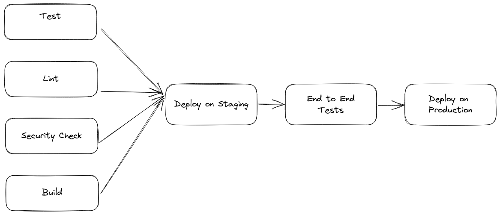

# GitHub Actions 101

## Continuous Delivery



## Continuous Delivery - Definition

> Continuous Delivery is a software development practice that aims to automate
> the process of releasing code, so that new features can be made available to
> users as quickly as possible. This involves creating an automated process for
> building, testing, and deploying code, which allows new versions of the software
> to be released quickly and safely. Continuous delivery builds upon continuous
> integration and aims to increase the speed of software releases, improve the
> quality of the code, and reduce the risks associated with manual releases.

## Workflow File

`.github/workflows/branches.yml`

```yaml
name: Tests, Build and Deploy to Staging

on: push

env:
  PYTHON_VERSION: 3.11

concurrency:
  group: ${{ github.workflow }}-${{ github.ref }}
  cancel-in-progress: true

jobs:
  ...
```

## Triggers

* branches
* Tags
* pull requests
* issues
* discussion
* manual
* from other repositories

## Jobs

```yaml
jobs:
  test:
    ...

  build:
    ...
  
  deploy_on_staging:
    ...
  
  deploy_on_production:
    ...
```

## Our First Job

```yaml
  test:
    runs-on: self-hosted
    steps:
      # Always checkout code before do stuff
      - uses: actions/checkout@v2

      # `actions/...` are official github actions
      - uses: actions/setup-python@v3
        with:
          python-version: ${{ env.PYTHON_VERSION }}

      # This action is developed by mr BSFishy
      - uses: BSFishy/pip-action@v1
        with:
          requirements: requirements.txt

      # Run exec a command in default shell
      - name: Run Tests
        run: pytest hello.py
```

## Matrix

We can run multiple times the same action with a different
parameter.

```yaml
  test:
    runs-on: self-hosted
    strategy:
      matrix:
        python-version: [3.11, '3.10']
    steps:
      ...
      - uses: actions/setup-python@v3
        with:
          python-version: ${{ env.PYTHON_VERSION }}
      ...
```

Note: python '3.10' is between apostrophes because GitHub
takes as float, so 3.10 becomes 3.1.

## Conditional run

```yaml
  build:
    if: github.ref == 'refs/heads/main'
```

## Dependencies between jobs

We want to be sure that everything is ok before deploying to the staging environment

```yaml
  deploy_staging:
    name: Deploy to Staging
    needs: [lint, tests, security, build, ...]
```

## Services

Similar to a docker-compose

```yaml
jobs:
  test:
    ...
    services:
      postgres:
        image: postgres:13
        env:
          POSTGRES_USER: postgres
          POSTGRES_PASSWORD: postgres
          POSTGRES_DB: postgres
        ports:
          - 5432:5432
        options: >-
          --health-cmd pg_isready --health-interval 10s
          --health-timeout 5s --health-retries 5
      redis:
        image: redis:6
        ports:
          - 6379:6379
        options: >-
          --health-cmd "redis-cli ping" --health-interval 10s
          --health-timeout 5s --health-retries 5
```

## Build a composite Action

Let's build an action to execute Python install and download requirements

```yaml
name: Setup Python
description: 'Set up Python for use in actions by'
inputs:
  python-version:
    description: 'Version range or exact version of a Python version to use, using SemVer's version range syntax'
    required: true
    default: '3.x'

runs:
  using: composite
  steps:
    - uses: actions/setup-python@v3
      with:
        python-version: ${{ inputs.python-version }}

    - run: python -m pip install --upgrade pip
      shell: sh # NOTE this!
    
    - run: pip install -r requirements.txt
      shell: sh
```

## Use secrets

Settings -> Secrets -> Actions

```yaml
- run: aws s3 cp build/${{ github.sha }}.zip s3://my-artifacts-bucket/${{ github.sha }}.zip
  env:
    AWS_ACCESS_KEY_ID: ${{ secrets.AWS_ACCESS_KEY_ID }}
    AWS_SECRET_ACCESS_KEY: ${{ secrets.AWS_SECRET_ACCESS_KEY }}
```

## Use environment

Use the same secret name in different environments

```yaml
jobs:
  deployment:
    runs-on: ubuntu-latest
    environment: production # <--
    steps:
      # ...
      - run: aws s3 cp build/${{ github.sha }}.zip s3://my-artifacts-bucket/${{ github.sha }}.zip
        env:
          AWS_ACCESS_KEY_ID: ${{ secrets.AWS_ACCESS_KEY_ID }}           # Note those secrets will 
          AWS_SECRET_ACCESS_KEY: ${{ secrets.AWS_SECRET_ACCESS_KEY }}   # be different for staging/production
```

## Troubleshooting

### Node 12 deprecation

> Node.js 12 actions are deprecated. Please update the following actions to use
> Node.js 16: actions/checkout@v2, actions/setup-python@v2. For more information
> see: [https://github.blog/changelog/...]

Update those steps!

### Helm fail

Probably a previous helm upgrade has failed and there is some job or deployment broken.
You should check in the Kubernetes cluster if there is something wrong.

### Poetry install stuck

If the cache is not clean in self-hosted runners there could be a lock file that blocks
dependencies downloads.

Please, add this step before all `poetry install` steps.

```yaml
- run: |
  poetry config virtualenvs.in-project true
  find ~/.cache/pypoetry/ -name '*.lock' -delete
```
